#  Mr. Biology — LMS Platform

> **A high-end, premium E-Learning Management System (LMS) specifically crafted for Biology students.** 
> Engineered with a responsive, modern glassmorphism design, adaptive HLS video streaming, automated grading exams, and a powerful administrative suite.

---

<p align="center">
  
  
  
  
  
  
</p>

---

## 1. Project Title
**Mr. Biology (منصة الأستاذ أحمد عياد التعليمية)**  
A comprehensive, enterprise-level digital academy for teaching biology, providing students with interactive tools, secure video playback, and a rich user experience.

---

## 2. Short Description
**Mr. Biology** is a responsive, highly optimized Single Page Application (SPA) designed to deliver biology courses to secondary school students. The platform focuses on security, seamless rich-media execution, and extensive management. Students can watch high-quality adaptive lectures (via customized **HLS streaming**), submit home duties, take timed interactive examinations with instant analytics, and unlock paid materials via a integrated Egyptian payment gateway integration. The app also features a deep and modern **Admin Control Center** providing full CRUD operations over courses, user groups, payments, exam questionnaires, and course subscriptions.

---

## 3. Demo / Preview
🚀 **Live Production Link:** [https://mr-biology.com](https://mr-biology.com)  
🧪 **Staging / Test Link:** [https://mr-biology-staging.vercel.app](https://mr-biology-staging.vercel.app) *(Placeholder)*

> [!NOTE]
> The platform is fully localized in **Arabic (RTL)** to fit the target Egyptian curriculum, using the premium **Cairo** typography and beautiful glassmorphism gradients optimized for dark-mode.

---

## 4. Screenshots Section

### 🖥️ Desktop Overview
```
┌───────────────────────────────────────────────────────────────────────────┐
│ [Logo] Mr. Biology                الرئيسية   كورساتي   الامتحانات   [الملف الشخصي]  │
├───────────────────────────────────────────────────────────────────────────┤
│                                                                           │
│   ┌───────────────────────┐   ┌───────────────────────┐                   │
│   │     مجموعة الطالب     │   │    عدد الكورسات       │                   │
│   │        Group-A        │   │          12           │                   │
│   └───────────────────────┘   └───────────────────────┘                   │
│                                                                           │
│   الكورسات المضافة حديثاً:                                                    │
│   ┌───────────────────┐ ┌───────────────────┐ ┌───────────────────┐       │
│   │ [Course Cover]    │ │ [Course Cover]    │ │ [Course Cover]    │       │
│   │ علم الأحياء للثانوية  │ │ علم الوراثة        │ │ الخلية والتركيب    │       │
│   │ 200 جنيه          │ │ مجاناً            │ │ 150 جنيه          │       │
│   │ [شراء الآن]        │ │ [اشترك الآن]       │ │ [شراء الآن]        │       │
│   └───────────────────┘ └───────────────────┘ └───────────────────┘       │
│                                                                           │
└───────────────────────────────────────────────────────────────────────────┘
```

> *Suggested banner visual layout:* A high-contrast modern glassmorphic dashboard showcasing students' grades, recent course widgets, and the secure video player layout.

---

## 5. Features

### 🎓 Student Experience
*   **Adaptive HLS Video Streaming (`hls.js`):** Secure, buffer-free playback that dynamically adjusts quality based on network throughput. Prevents straightforward video stealing.
*   **Timed Exams & Instant Grading:** Interactive testing console supporting multiple question types, automated result calculation, and in-depth question-by-question review screens.
*   **Duties & Assignments Manager:** Students can upload homework files, monitor their status, and read custom teacher feedback.
*   **Live Classes Calendar:** Integration showing real-time upcoming live online meetings and active streaming classes.
*   **Payment Gateway Integration:** Instant payment requests enabling access to premium courses, supporting online banking, fawry, and credit card payments.

### 🛡️ Administrative Portal
*   **Course Builder & Lecture Manager:** Complete control to construct courses, upload videos, and organize curricula chapters.
*   **Exams & Questions Generator:** Admin workspace to draft question banks, assign grades, and configure test timers.
*   **Subscription & Payments Auditor:** Audit panel to verify transaction orders, approve registration requests, and trace platform income.
*   **Student Groups Division:** Partition students into customizable educational groups (e.g. Center, Online, Group A/B) for customized progress analytics.

---

## 6. Tech Stack

| Domain | Technologies Used |
| :--- | :--- |
| **Frontend Framework** | React 18 (Vite SPA) |
| **Language** | TypeScript (Strict mode enabled) |
| **Styling & Themes** | Tailwind CSS, Shadcn/ui, Radix UI Primitives, Lucide Icons |
| **Animations** | Framer Motion (Fluid transitions & glass effects) |
| **Video Playback** | Hls.js, Plyr React, Video.js |
| **Data Fetching** | TanStack Query v5, Axios |
| **Form Management** | React Hook Form + Zod (Strict validation schemas) |

---

## 7. Installation

Follow these steps to set up the project locally.

### Prerequisites
*   Node.js (v18.x or later recommended)
*   npm or yarn

### Setup Steps
1.  **Clone the Repository:**
    ```bash
    git clone https://github.com/devway1/Mr-Biology.git
    cd Mr-Biology
    ```

2.  **Install Dependencies:**
    ```bash
    npm install
    ```

3.  **Configure Environment Variables:**
    Create a `.env` file in the root directory (refer to [Section 8](#8-environment-variables)).

---

## 8. Environment Variables

Create a `.env` file in the project's root folder and populate it with the appropriate values:

```env
# The Base URL of the Mr. Biology Backend APIs
VITE_BASE_API=https://apis.mr-biology.com
```

> [!WARNING]
> Do not commit your production `.env` files to git. They are ignored by default via `.gitignore`.

---

## 9. Running the Project

The package includes several scripts to run and build the application:

```bash
# Start local development server (Vite hot-reloading)
npm run dev

# Lint code for errors and formatting issues
npm run lint

# Build production bundle optimized for high-performance deployment
npm run build

# Preview the local production build
npm run preview
```

---

## 10. Folder Structure

The project has a modular, feature-based architecture following React clean-code standards:

```text
mr_biology/
├── .vscode/               # VSCode workspace configurations
├── public/                # Static assets (favicons, logos)
├── src/
│   ├── assets/            # Global assets, images, and fonts
│   ├── components/        # Reusable UI components
│   │   ├── ui/            # Radix UI + Shadcn customized primitives
│   │   ├── AdvancedPlayer # Adaptive HLS Player wrapping hls.js
│   │   ├── Navbar.tsx     # Responsive RTL navigation bar
│   │   └── Sidebar.tsx    # Workspace control panels
│   ├── context/           # React Context Providers
│   │   ├── AuthContext    # Handles Student login, token expiry, & refresh
│   │   └── AdminAuthContext
│   ├── hooks/             # Custom utility React hooks
│   ├── layouts/           # Global layout containers
│   │   ├── AdminLayout.tsx
│   │   └── DashboardLayout.tsx
│   ├── lib/               # Internal configurations (e.g., Tailwind merge helper)
│   ├── pages/             # Route pages grouped by module
│   │   ├── admin/         # Admin sub-panels (Courses, Exams, Payments)
│   │   ├── auth/          # Authentication screens (Login, Register)
│   │   ├── user/          # Student user views (Lectures, Exams, Profile)
│   │   ├── Index.tsx      # Main portal landing page
│   │   └── NotFound.tsx   # Elegant 404 handler
│   ├── utils/             # Helper utilities (e.g. LazyLoader)
│   ├── App.tsx            # Main router and context nesting configurations
│   └── main.tsx           # Application entry point
├── tailwind.config.ts     # Core styling system tokens
├── tsconfig.json          # Strict TypeScript configurations
└── vercel.json            # Vercel routing rules for client-side routing
```

---

## 11. API Endpoints

The frontend client securely connects with the centralized microservice layer via `VITE_BASE_API`. Below are core transactional routes:

### 🔐 Student Authentication & Operations
*   `POST /student/account/updateStudentToken` - Renew active session via refresh-token.
*   `GET /student/getStatistics` - Fetches student dashboard counts and group allocations.
*   `GET /student/courses/getCourses` - Returns all accessible and recommended courses.
*   `POST /student/payments/subscription` - Triggers a payment checkout flow.

---

## 12. Authentication Flow

The application implements a secure, **sliding-session token renewal system** to keep users authenticated without compromising security.

```mermaid
sequenceDiagram
    autonumber
    actor Student
    participant Browser as React Client
    participant API as Backend Server

    Student->>Browser: Enters Credentials
    Browser->>API: POST /login (Student Code / password)
    API-->>Browser: returns student_token, refresh_token, token_expiry
    Note over Browser: Save tokens in LocalStorage
    Browser->>Browser: Start 60s background check interval
    
    rect rgb(25, 30, 50)
        Note over Browser: Token near expiry (<= 5 min left)
        Browser->>API: POST /updateStudentToken (refresh_token)
        API-->>Browser: returns new student_token + updated expiry times
        Note over Browser: Store updated credentials seamlessly
    end
```



> [!TIP]
> This sliding session ensures students remain uninterrupted during long lecture sessions or live assessments, while fully securing endpoints using short-lived access credentials.

---

## 13. Deployment

The project is pre-configured for seamless deployments on **Vercel** or any cloud static-hosting service.

### Single Page Application (SPA) Routing Rewrite
To ensure React Router DOM functions correctly when users deep-link or refresh on a page like `/my-courses/course/123`, the following `vercel.json` rewrite file is pre-configured in the project root:

```json
{
  "rewrites": [
    {
      "source": "/(.*)",
      "destination": "/index.html"
    }
  ]
}
```

---

## 14. Future Improvements

*   [ ] **Offline Playback:** Implement secure service worker caches to download encrypted video segments for offline study.
*   [ ] **In-App Messaging System:** direct chat channels between students and instructors/teaching assistants.
*   [ ] **Gamification Engine:** Unlock achievement badges and score streaks as students progress through lessons.
*   [ ] **Automated Dynamic Subtitles:** Incorporate speech-to-text generation for video lectures to aid accessibility.

---

## 15. Contributing

Contributions are what make the open source community such an amazing place to learn, inspire, and create. Any contributions you make are **greatly appreciated**.

1.  Fork the Project
2.  Create your Feature Branch (`git checkout -b feature/AmazingFeature`)
3.  Commit your Changes (`git commit -m 'Add some AmazingFeature'`)
4.  Push to the Branch (`git push origin feature/AmazingFeature`)
5.  Open a Pull Request

---

## 16. License

Distributed under the **MIT License**. See `LICENSE` for more details.

---

## 17. Contact Information

*   **Instructor:** Mr. Ahmed Ayad (الأستاذ أحمد عياد)
*   **Platform Coordinator:** [support@mr-biology.com](mailto:support@mr-biology.com)
*   **Technical Dev Team:** DevWay Team
*   **Social Channels:** [Facebook Community Page](https://www.facebook.com/share/1ADZVJYWS5/?mibextid=wwXIfr)

---

<p align="center">
  Made with ❤️ by DevWay Team for a better digital educational future.
</p>
